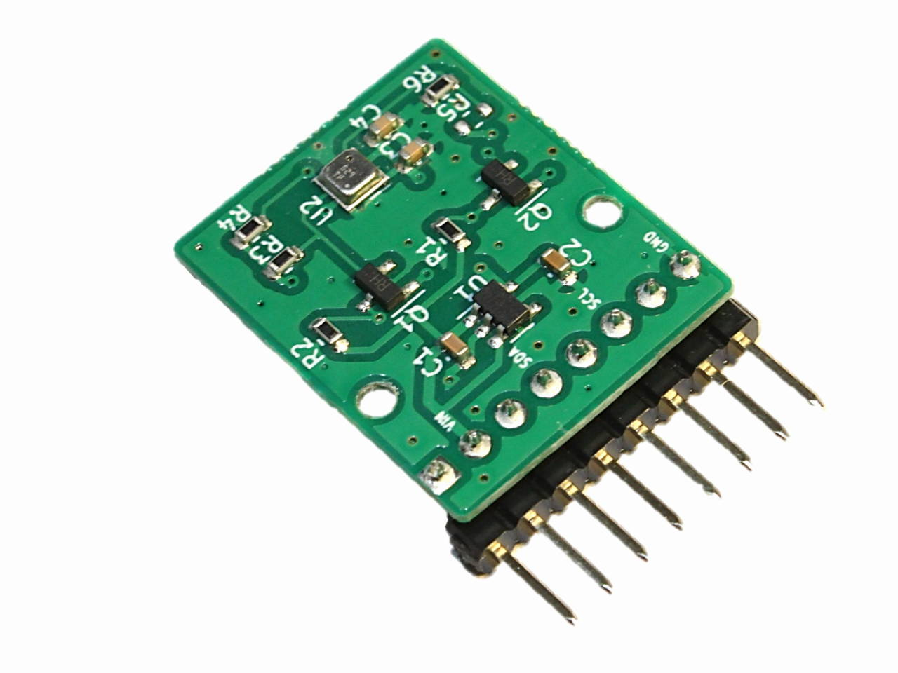

# M5StickC Proto Hat向け空気質センサボード（BME688搭載）

## 概要
  

  
  

  * M5Stack製 <a href="https://docs.m5stack.com/en/hat/hat-proto" target="_blank">M5StickC Proto Hat</a> にぴったり収まる、Bosch製の小型な空気質センサ <a href="https://www.bosch-sensortec.com/products/environmental-sensors/gas-sensors/bme688/" target="_blank">BME688</a>（ガス/温度/気圧/湿度）を搭載した小型のブレイクアウトボードです。
  * はんだ付け不要で、M5StickC Proto Hat の基板と置き換えるだけで使用できます。M5Stack製の以下製品と組み合わせた空気質モニターの用途に最適です。
    * <a href="https://docs.m5stack.com/en/core/m5stickc" target="_blank">M5StickC</a> / <a href="https://docs.m5stack.com/en/core/m5stickc_plus" target="_blank">M5StickC Plus</a>
    * <a href="https://docs.m5stack.com/en/core/coreink" target="_blank">CoreInk</a>
    * <a href="http://docs.m5stack.com/en/core/atom_lite" target="_blank">ATOM Lite</a> / <a href="http://docs.m5stack.com/en/core/atom_matrix" target="_blank">ATOM Matrix</a> + <a href="http://docs.m5stack.com/en/atom/atom_mate" target="_blank">ATOM Mate</a> に含まれる ATOM Hat
  * M5StickC Proto Hat を使用せず、ブレッドボードなどでも使用が可能です。

  製品のサポートや、M5StickC Proto Hat の基板入替手順などについては、<a href="https://mktechlab.net/aq-sensor-board-bme688/" target="_blank">M5StickC Proto Hat向け空気質センサボード（BME688搭載） サポートページ</a> を参照ください。

## サンプルプログラム
  以下 M5Stack 製品に対応したサンプルプログラムを用意しています。サンプルプログラムはネットワークに接続せず、センサから読み出した値を表示するのみのオフラインモードと、IoTデータの可視化サービス <a href="https://ambidata.io/" target="_blank">Ambient</a> へのデータアップロードに対応したオンラインモードに対応しています。  
  どちらのモードも、PCとのUSB接続によるUARTシリアル出力での確認、M5StickC / M5StickC Plus / CoreInk は搭載している画面で 空気質インデックス（IAQ）/温度（℃）/相対湿度（%）/バッテリー残量（%）などの確認が可能です。  
  空気質インデックス（IAQ）の詳細については、<a href="https://www.bosch-sensortec.com/media/boschsensortec/downloads/datasheets/bst-bme688-ds000.pdf" target="_blank">BME688データシート</a>（PDF） の P.11 "Table 6: Index for Air Quality (IAQ) classification and color-coding" を参照ください。 

  サンプルプログラムは M5Unifiedライブラリ を使用することで、以下 M5Stack製品について個別プログラムではなく、共通プログラム（bme688-board-m5unified）として提供しています。

  | M5Stack製品名 | 特徴・注意事項 |
| ---- | ---- |
| M5StickC / M5StickC Plus | LCDでの IAQ/温度/相対湿度などの値の表示、各値に応じた注意レベルを3段階（緑/オレンジ/赤）で表示します。注意レベルの閾値は必要に応じて修正が可能です。 画面の明るさは、M5ロゴのボタン長押しで4段階（中間→明るめ→オフ→暗め→中間）の切り替えが可能です。 1画面の表示データは3つまでですが、M5ロゴのボタン短押しで表示対象を切り替えることが可能で、表示対象の修正も可能です（プログラムの各種設定の DISP_VAL を参照）。 デフォルトの更新間隔は約10秒、アップロード間隔は約1分です。内蔵バッテリーのみで約1時間の動作を確認しています。 ※プログラム書き込み後はUSBケーブルを抜き電源を入れなおしてください。 ※WiFi接続状態が悪い環境で接続に時間がかかる場合、バッテリーの持ちが短くなります。 |
| CoreInk | 電子ペーパーでの IAQ/温度/相対湿度などの値の表示が可能です。 1画面の表示データは3つまでですが、多機能ボタンを上方向短押しで表示対象を切り替えることが可能で、表示対象の修正も可能です。（プログラムの各種設定の DISP_VAL を参照） デフォルトの更新間隔・アップロード間隔は約1分です。内蔵バッテリーのみでオンラインモードで約12時間の動作を確認しています。 ※プログラム書き込みまたは充電後はUSBケーブルを抜き、背面のリセットボタンを押してください。 ※WiFi接続状態が悪い環境で接続に時間がかかる場合、バッテリーの持ちが短くなります。 |
| ATOM Lite / ATOM Matrix | 表示デバイスを搭載していないため、PCとの USB接続による UARTシリアル出力と、IAQ/温度/相対湿度などの値を LEDの色（緑/オレンジ/赤）で確認できます。 LEDの明るさはボタン長押しで4段階（中間→明るめ→オフ→暗め→中間）の切り替えが可能です。 ボタン短押しで表示データを順に切り替えることが可能で、表示対象の修正も可能です。（プログラムの各種設定の LED_VAL を参照） デフォルトの更新間隔は約10秒、アップロード間隔は約1分です。 |

  サンプルプログラムについては、以下開発環境での動作を確認しています。  
  ※CoreInk のみ Arduino IDE 2.0.3 と M5Stack 2.0.4 の組み合わせで書き込み(Upload)エラー（"Property 'upload.tool.serial' is undefined"）が発生するため、他の動作確認済みバージョンの組み合わせをお使いください。
  * <a href="https://www.arduino.cc/en/software" target="_blank">Arduino IDE</a>: 2.0.3 / 1.8.19
  * <a href="https://docs.m5stack.com/en/quick_start/arduino" target="_blank">ボードマネージャの M5Stack のバージョン</a>: 2.0.4 / 2.0.2

  以下ライブラリをインストールします。  
  Arduino IDE: [スケッチ] -> [ライブラリを管理] の検索で対象のライブラリ名を入力、対応バージョンを指定してインストールします。
  * <a href="https://docs.m5stack.com/en/quick_start/m5unified/helloworld" target="_blank">M5Unified</a>: 0.1.1
  * <a href="https://docs.m5stack.com/en/quick_start/m5gfx/m5gfx" target="_blank">M5GFX</a>: 0.1.1
  * <a href="https://ambidata.io/docs/esp8266/#library_import" target="_blank">Ambient ESP32 ESP8266 lib</a>: 1.0.3  
  * <a href="https://github.com/FastLED/FastLED" target="_blank">FastLED</a>: 3.5.0

  続いて、BME688用の以下ライブラリをリンク先からZIPファイルをダウンロード後、ライブラリをインストールします。  
  Arduino IDE: [スケッチ] -> [ライブラリをインクルード] -> [.ZIP形式のライブラリをインストール]

  * <a href="https://github.com/BoschSensortec/Bosch-BSEC2-Library" target="_blank">Bosch-BSEC2-Library</a>: v1.3.2200
  * <a href="https://github.com/BoschSensortec/Bosch-BME68x-Library" target="_blank">Bosch-BME68x-Library</a>: v1.1.40407
  
  ### センサデータの一覧
  各出力データの詳細については、<a href="https://www.bosch-sensortec.com/media/boschsensortec/downloads/datasheets/bst-bme688-ds000.pdf" target="_blank">BME688データシート</a>（PDF）の P.31 "Table 20: BSEC outputs" を参照ください。  
  温度、相対湿度、気圧以外のガスセンサに関する IAQ/sIAQ/eCO2/bVOC の値については Boschソフトウェアライブラリ BSEC による出力の値が安定(accuracyが1以上)してからの表示となるため起動後5分程度かかります。
  | プログラム内部データ名 | BSEC出力名 | 説明 |
| ---- | ---- | ---- |
| IAQ | IAQ (0-500) | モバイルデバイス向けの空気質インデックス値 |
| sIAQ (ppm) | Static IAQ ("s-IAQ") | 据え置きデバイス向けの空気質インデックス値 |
| eCO2 (ppm) | CO2 equivalents (ppm) | CO2推定値 |
| bVOC (ppm)  | b-VOC equivalents (ppm) | 息に含まれる揮発性有機化合物（VOC）相当値 |
| rTMP (℃) | Raw temperature (℃) | センサAPIからの温度Rawデータ |
| TEMP (℃) | Ambient temperature (℃) | センサ内部の熱源の影響を考慮した補正済みの温度 |
| rHMD (%) | Raw relative humidity (%) | センサAPIからの相対湿度Rawデータ |
| HUMI (%) | Ambient relative humidity (%) | センサ内部の熱源の影響を考慮した補正済みの相対湿度 |
| PRES (hPa) | Raw Pressure [Pa] | センサAPIからの気圧Rawデータを100倍した値 |
| BATT (%) | - | バッテリー残量 M5StickC / M5StickC Plus / CoreInk のみ |

  ### オンラインモード（Ambient）時のアップロードデータについて
  オンラインモード（Ambient）時にアップロードされるデータの一覧は以下の通り。 Ambient側のチャネル設定については、以下の Ambient側のデータ名 を参考に設定してください。  
  Boschソフトウェアライブラリ BSEC による出力の値が安定(accuracyが1以上)してからのアップロードとなるため起動後5分程度かかります。
  | データID | プログラム内部データ名 | Ambient側データ名の例 | 説明 |
| ---- | ---- | ---- | ---- |
| 1 | IAQ | IAQ | モバイルデバイス向けの空気質インデックス値 |
| 2 | sIAQ | sIAQ | 据え置きデバイス向けの空気質インデックス値 |
| 3 | eCO2 | eCO2[ppm] | CO2推定値 |
| 4 | bVOC | bVOC[ppm] | 息に含まれる揮発性有機化合物（VOC）相当値 |
| 5 | TEMP | TEMP[℃] | センサ内部の熱源の影響を考慮した補正済みの温度 |
| 6 | HUMI | HUMI[%RH] | センサ内部の熱源の影響を考慮した補正済みの相対湿度 |
| 7 | PRES | PRES[hPa] | センサAPIからの気圧Rawデータを100倍した値 |
| 8 | BATT | BATT[%] | M5StickC / M5StickC Plus / CoreInk のみ |

  ### プログラムの各種設定について
  各種設定は config.h ファイルで行います。  
  基本の設定は以下の通り。  
  | #define | 説明 |
| ---- | ---- |
| UPLOAD_DATA_EN | オンラインモード（Ambient）で使用する場合に有効にして、WIFI_SSID、WIFI_PASS、AMB_CH_ID、AMB_WR_KEY の値を指定してください。 |
| LANG_JA_EN | 日本語表示にする場合に有効にしてください。対象はタイトル・各種状態表示・データのラベルと単位となりますが、データの値は英語と共通のフォントで変わりません。 |
  
  ネットワーク、他の設定は以下の通り。
  | 定数名 | 説明 |
| ---- | ---- |
| WIFI_SSID | WiFiのSSID文字列、******** を置き換えてください。 |
| WIFI_PASS | WiFiのパスワード文字列、******** を置き換えてください。 |
| AMB_CH_ID | Ambient のチャネルID（数値）、0 を使用する ID に置き換えてください。 |
| AMB_WR_KEY | Ambient のチャネルID（16桁の文字列）、**************** を置き換えてください。 |
| UPDATE_INTERVAL_S | センサデータの表示間隔（秒） デフォルト値 10 範囲 3～3600 ※内部でのセンサからのデータ取得間隔は "Low power mode" のため 3秒です。 ※CoreInk はリフレッシュ頻度を抑えるため 60未満を設定した場合でもプログラム側で 60 に設定されます。 |
| UPLOAD_INTERVAL_S | センサデータの Ambient へのアップロード間隔（秒） デフォルト値 60 範囲 30～3600 |

  M5StickC / M5StickC Plus / CoreInk については、各画面（ページ）で表示するデータについて、DISP_VAL でカスタマイズが可能です。 ページ番号1は異なる環境の場所に持ち運んだり空気質に影響する揮発性有機化合物（VOC）の濃度が頻繁に変化するシーンを、ページ番号2は同じ部屋で固定して長時間での空気質を測定するシーンでの表示を想定しています。
  | ページ番号 | データ1 | データ2 | データ3 |
| ---- | ---- | ---- | ---- |
| 1 | D_TYPE_IAQ | D_TYPE_AMB_TEMP | D_TYPE_AMB_HUMI |
| 2 | D_TYPE_sIAQ | D_TYPE_AMB_TEMP | D_TYPE_AMB_HUMI |
| 3 | D_TYPE_eCO2 | D_TYPE_bVOC | D_TYPE_RAW_PRES |

  ATOM Lite / ATOM Matrix については、LEDで表示するデータについて、LED_VAL でカスタマイズが可能です。
  | データ1 | データ2 | データ3 | データ4 | データ5 | データ6 |
| ---- | ---- | ---- | ---- | ---- | ---- |
| D_TYPE_IAQ | D_TYPE_sIAQ | D_TYPE_AMB_TEMP | D_TYPE_AMB_HUMI | D_TYPE_eCO2 | D_TYPE_bVOC |

  各データのオフセット値については、OFS_VAL で指定します。  
  ※デフォルトのオフセット値については、M5StickC Proto Hat（カバーあり）での使用を想定したオフセット値となっていますが、センサ周辺環境などによって変わるため、お使いの環境に合わせたオフセット値に修正してください。
  | Board | IAQ | sIAQ | eCO2 | bVOC | rTMP | TEMP | rHMD | HUMI | PRES |
| ---- | ---- | ---- | ---- | ---- | ---- | ---- | ---- | ---- | ---- |
| M5StickC | 0.0 | 0.0 | 0.0 | 0.0 | -4.2 | -4.2 | 13.0 | 13.0 | 0.0 |
| M5StickC Plus | 0.0 | 0.0 | 0.0 | 0.0 | -4.2 | -4.2 | 13.0 | 13.0 | 0.0 |
| M5Stack CoreInk | 0.0 | 0.0 | 0.0 | 0.0 | -1.9 | -1.9 | 9.0 | 9.0 | 0.0 |
| M5Atom Lite/Matrix | 0.0 | 0.0 | 0.0 | 0.0 | -2.4 | -2.4 | 9.4 | 9.4 | 0.0 |

  各データのアラートレベルは AL_SET_RANGE で、LV1の最小値と最大値と LV2の最小値と最大値を指定します。
  * M5StickC / M5StickC Plus: 画面のセンサ数値の文字色
  * ATOM Lite / ATOM Matrix: RGB LED の色

  | ID | LV1（快適） 緑色 | LV2（注意） オレンジ色 | LV3（要注意） 赤色 |
| ---- | ---- | ---- | ---- |
| IAQ | 0.0以上 150.0未満 | 150.0以上 250.0未満 | 250.0以上 |
| sIAQ | 0.0以上 150.0未満 | 150.0以上 250.0未満 | 250.0以上 |
| eCO2 | 0.0以上 1000.0未満 | 1000.0以上 2000.0未満 | 2000.0以上 |
| bVOC | 0.0以上 1.4未満 | 1.4以上 40.0未満 | 40.0以上 |
| rTMP | 22.0以上 26.0未満 | 16.0以上 22.0未満 or 26.0以上 30.0未満 | 16.0未満 or 30.0以上
| TEMP | 22.0以上 26.0未満 | 16.0以上 22.0未満 or 26.0以上 30.0未満 | 16.0未満 or 30.0以上 
| rHMD | 40.0以上 50.0未満 | 20.0以上 40.0未満 or 50.0以上 60.0未満 | 20.0未満 or 60.0以上 
| HUMI | 40.0以上 50.0未満 | 20.0以上 40.0未満 or 50.0以上 60.0未満 | 20.0未満 or 60.0以上 

## 注意事項
  * 医療用途や工業用途、厳密な測定が必要な用途には使用しないでください。
  * センサには触れないようご注意ください。
  * 初めてお使いになる際は安定したデータ取得のために、少なくとも24時間以上のバーンイン（本サンプルプログラムなどでの連続動作）を行ってください。  
  バーンイン後の起動時は、センサのデータ（ガスセンサに関連するIAQ、bVOC、eCO2などの値）が安定するまで30分程度かかります。

## お問い合わせ先
  製品に関するご不明点やご質問につきましては、<a href="https://mktechlab.net/about/" target="_blank">こちら</a> からお問い合わせください。

## 資料
  * <a href="https://www.bosch-sensortec.com/products/environmental-sensors/gas-sensors/bme688/" target="_blank">BME688製品ページ</a>
  * <a href="https://www.bosch-sensortec.com/media/boschsensortec/downloads/datasheets/bst-bme688-ds000.pdf" target="_blank">BME688データシート</a>（PDF）
